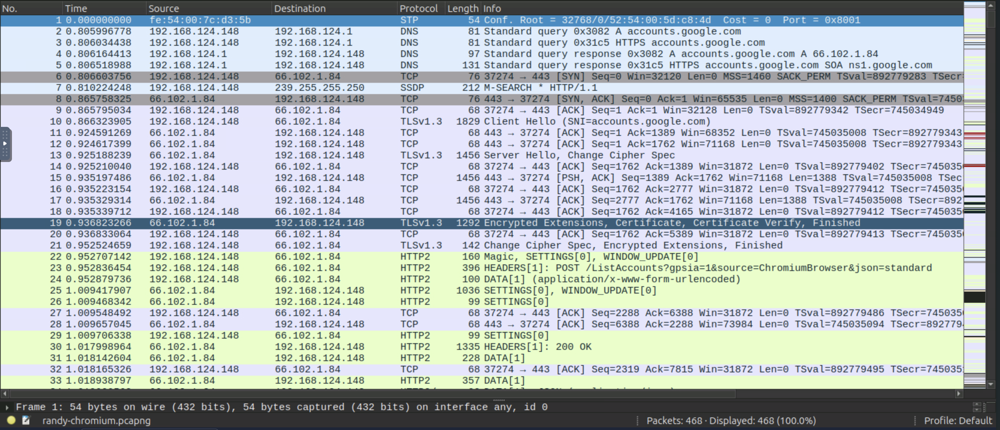
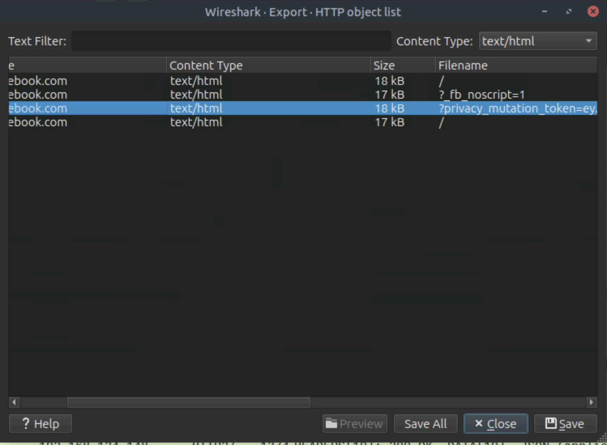

# Solutions to Lab

## Process:

Here, I retrieved the files inside the machine:

```bash
ls
# randy-chromium.pcapng  ssl-key.log
```

Then, opened the Wireshark and decrypted the SSL key file to decrypt the traffic.



After that, I discovered the export objects in the Wireshark menu. 



Since this is encrypted traffic, it needs to be viewed on the Wireshark GUI Application itself. 


