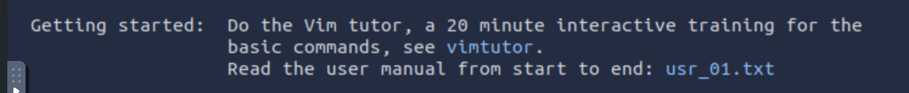
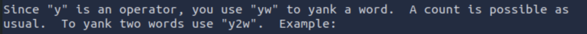
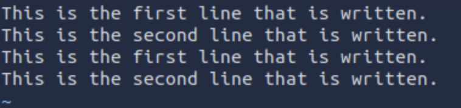

# Toolkit: Vim (Challenge) 

[Link to the challenge](https://tryhackme.com/room/toolboxvim)

## Hands-on Labs and challenges faced

#### Found something interesting

While solving the entire challenge, I found the command of `vimtutor` listed on the manual that provides a step-by-step process on how to utilise and control `vim` in a terminal. It took around 10 to 20 minutes to understand the fundamental usage of Vim. 

#### The challenge to find answer on Task 2 Question 2 and 9 + the solution

Task 2 Question 2: ***How do we start entering text into our new Vim document?***

I cannot find the answer all around the documentation. My initial thought was "insert" or "append" to enter a text into a Vim document, as it allows me to enter any text using insert mode or append the text and it goes into it. After thinking for some moment, a thought comes: **If you reached into insert mode, then what would you do?** This is the question that gets the answer on the statement above.

Task 2 Question 9: ***How do we jump to the end of the word?***

This involves a little bit of exploration. I tried different keys into Vim so it performs on what the question is asking. After experimenting it a little bit, the answer is: previous answer, but the location is located at the next letter in keyboard. 

#### The process to find the answer on Task 3 Question 2

Task 3 Question 2: ***How do we write the file, but don't exit- as root?***

Now, I did not expect this question to come up. I searched online, and found this article, which explains clearly on the answer. The answer is located on this [link](https://www.cyberciti.biz/faq/vim-vi-text-editor-save-file-without-root-permission/). The link provided has explained step-by-step on what the command does in a smaller detail.

#### The process to find the answer on Task 4 Question 1

Task 4 Question 1: ***How do we copy a line?***

My thought: I do not know anything about copying is possible in Vim. Because of that, I went through the `vimtutor` and scroll through the very bottom of the page. It provides the detailed user manual by typing `:help user-manual`. Then, I look closely on a section that relates with the question. There is the section of it and provide the manual of that section helps me to find the answer.

#### The challenge of determine the answer on Task 4 Question 2

Task 4 Question 2: ***how do we copy 2 lines?***

Hmm, this answer would be located the same section as above, so it would be simple to determine it. The snapshot below shows the usage of copying 2 words: 

So, if you copy 2 words using `y2w`, then copying 2 lines would be `y2y`. However, the answer that TryHackMe wants is not that command. This snapshot shows that 2 lines are copied in Vim using `y2y`:

## Results

Right now, I was able to answer task 1 all the way through task 3. Task 4 is partially answered and the rest are not yet answered. 

## Conclusion

This room provides an additional skill on using a powerful and advanced text editor in Linux Operating System, which is called Vim. It provides more features compared with nano text editor, where it can copy and paste texts and/or lines in a text editor.

