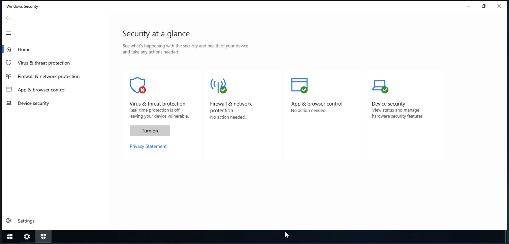

# Windows Fundamentals - Part 3 - TryHackMe Walkthrough

[Room Link](https://tryhackme.com/room/windowsfundamentals3xzx)

## Executive Summary

This room covers about Windows in the Security perspective. It covers the ability to understand the fundamental security feature of Windows Operating System and view inbound as well as outbound rules of a firewall that the Operating System has offer.

## Key Concepts

- Windows Security - The built-in Windows Settings that allows the user to view any security measures in the Windows device.
  - Antivirus protection - The sub-section of the Windows Security feature that allows the user to scan malicious files in a scale they want, for instance quick and complete scan.
  - Firewall - A sub-section of the Windows Security feature that adds an application to be filtered by a firewall. For instance, creating an inbound and outbound network for a specific service.
  - Exploit Protection - A sub-section of the Windows Security feature that allows the user to enable or disable certain settings related to exploit, such as image blocker, data blocker, etc.
- Windows Updates - The feature that allows Windows to check for Updates in the Operating System.

## Hands-on Activity with explanations

#### View Update History

The impact that I gain when I done this is it allows me to understand and analyse any vulnerabilities that are present based on the version number. For instance, this version of Microsoft Defender has a vulnerability where the user has the ability to enter into the administrator account via software bugs. The way to patch this issue is to update the version of the Windows Defender, since it is already outdated.

#### View Windows Security Settings

The impact that it gains to the business is it allows the administrator to maximise the security protection on the device and prevent any threats that may come in the future.

#### View an inbound and outbound rules of a specific service in Windows

The impact of viewing an inbound and outbound rules is to determine a service with incoming and outgoing connections from a specific service by another network. For instance, if the system allows the service `AllJoyn Router`, then not every network will be able to access this service as it has firewall filtered both in and outgoing connections.

#### Explore the Exploit Protection Settings

The impact for me, as a learner, is curiosity and out-of-the-box thinking. The question is: How does modern malware able to bypass these system checks, or How does a user get tricked by not knowing if a software or app is a malware or infoStealer?

## Reflection

- How does these concepts apply in the real world?

These concepts are applied for almost everyone who uses Windows OS as this concept serves as a basic cyber hygiene on how to protect the system from any harm involved.

- What skills does it apply?

It applies a number of skills, from the hard or technical skill, it trains the ability to configure inbound and outbound rules of the firewall as well as  security settings of a Windows Operating System. The soft skill that is utilised on this room relies on self awareness, as it allows the user to determine what services and applications that are enabled and disabled in the Windows Operating System. 

